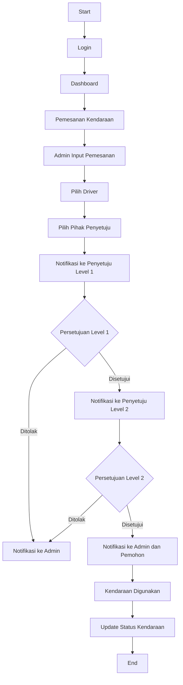

# Aplikasi Pemesanan Kendaraan Perusahaan Tambang

Aplikasi web untuk memonitoring dan mengelola pemesanan kendaraan di perusahaan tambang nikel.

## Fitur Utama

- Autentikasi dan Otorisasi (Admin dan Pihak Penyetuju)
- Dashboard dengan grafik pemakaian kendaraan
- Manajemen Kendaraan
- Manajemen Driver
- Pemesanan Kendaraan
- Persetujuan Berjenjang (minimal 2 level)
- Laporan Periodik (dengan fitur ekspor ke Excel)
- Log Aktivitas Aplikasi

## Teknologi yang Digunakan

- PHP 8.1
- Laravel 10.x
- MySQL 8.0
- Breeze (Autentikasi)
- Spatie Packages (Otorisasi)

## Persyaratan Sistem

- PHP >= 8.1
- Composer
- Node.js & NPM
- MySQL

## Struktur Database

### Penjelasan Entitas:

- USERS: Menyimpan data pengguna aplikasi, termasuk admin dan pihak yang menyetujui.
- KENDARAAN: Berisi informasi tentang kendaraan yang tersedia untuk dipesan.
- DRIVER: Menyimpan data pengemudi yang dapat ditugaskan untuk pemesanan.
- PEMESANAN: Mencatat detail pemesanan kendaraan.
- PERSETUJUAN: Menangani proses persetujuan berjenjang untuk setiap pemesanan.

### Relasi:

- Seorang USER dapat membuat banyak PEMESANAN.
- Seorang USER dapat memberikan banyak PERSETUJUAN.
- Sebuah KENDARAAN dapat digunakan dalam banyak PEMESANAN.
- Seorang DRIVER dapat ditugaskan dalam banyak PEMESANAN.
- Sebuah PEMESANAN memerlukan satu atau lebih PERSETUJUAN.

Diagram ini menggambarkan struktur data dan hubungan antar entitas dalam aplikasi pemesanan kendaraan. Ini membantu dalam memahami alur data dan dependensi antar tabel dalam database.

## Flowchart Aplikasi

## Alur Kerja Aplikasi

1. Admin membuat pemesanan kendaraan
2. Sistem mengirim notifikasi ke Penyetuju Level 1
3. Jika disetujui, notifikasi dikirim ke Penyetuju Level 2
4. Jika disetujui oleh Penyetuju Level 2, pemesanan dikonfirmasi
5. Admin dan pemohon menerima notifikasi konfirmasi
