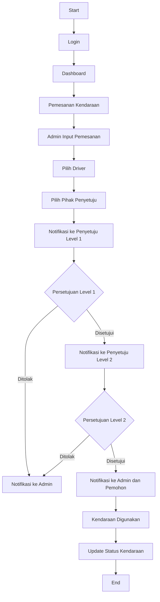

# Aplikasi Manajemen Pemesanan Kendaraan Tambang

Aplikasi ini adalah sistem manajemen pemesanan kendaraan yang memungkinkan admin dan approver untuk mengelola kendaraan, driver, serta pemesanan kendaraan.

## Fitur Utama

### 1. Dashboard
- Grafik pemakaian kendaraan berdasarkan jumlah pemesanan.
- Tombol untuk mengunduh laporan periodik pemesanan kendaraan dalam format Excel.
### 2. Manajemen Kendaraan
- Menambah, mengedit, dan menghapus informasi kendaraan.
- Dilengkapi dengan validasi data dan manajemen gambar kendaraan.
### 3. Manajemen Driver
- CRUD (Create, Read, Update, Delete) driver dengan informasi detail.
### 4. Manajemen Pemesanan
- Admin dapat membuat dan mengelola pemesanan kendaraan.
- Approver dapat melihat dan menyetujui pemesanan yang diajukan.
### 5. Persetujuan Pemesanan
- Persetujuan pemesanan oleh approver dengan dua tingkat: level 1 dan level 2.
- Status pemesanan diperbarui secara otomatis setelah disetujui oleh approver.
### 6. Ekspor Laporan
- Laporan periodik pemesanan kendaraan dapat diekspor ke dalam format Excel.

## Teknologi yang Digunakan

- Framework: Laravel 11
- Database: MySQL 8
- Authentication: Laravel Breeze
- Role Management: Spatie Laravel Permission
- Frontend: Blade Templates, Tailwind CSS, FlowBite
- Charting: Chart.js
- Export Excel: Laravel Excel (Maatwebsite)

## Persyaratan Sistem

- PHP >= 8.1
- Composer
- Node.js & NPM
- MySQL

## Struktur Database


### Penjelasan Entitas:

- USERS: Menyimpan data pengguna aplikasi, termasuk admin dan pihak yang menyetujui.
- KENDARAAN: Berisi informasi tentang kendaraan yang tersedia untuk dipesan.
- DRIVER: Menyimpan data pengemudi yang dapat ditugaskan untuk pemesanan.
- PEMESANAN: Mencatat detail pemesanan kendaraan.
- PERSETUJUAN: Menangani proses persetujuan berjenjang untuk setiap pemesanan.

### Relasi:

- Seorang USER dapat membuat banyak PEMESANAN.
- Seorang USER dapat memberikan banyak PERSETUJUAN.
- Sebuah KENDARAAN dapat digunakan dalam banyak PEMESANAN.
- Seorang DRIVER dapat ditugaskan dalam banyak PEMESANAN.
- Sebuah PEMESANAN memerlukan satu atau lebih PERSETUJUAN.

Diagram ini menggambarkan struktur data dan hubungan antar entitas dalam aplikasi pemesanan kendaraan. Ini membantu dalam memahami alur data dan dependensi antar tabel dalam database.

## Flowchart Aplikasi



## Alur Kerja Aplikasi

1. Admin membuat pemesanan kendaraan
2. Sistem mengirim notifikasi ke Penyetuju Level 1
3. Jika disetujui, notifikasi dikirim ke Penyetuju Level 2
4. Jika disetujui oleh Penyetuju Level 2, pemesanan dikonfirmasi
5. Admin dan pemohon menerima notifikasi konfirmasi

## Instalasi

1. Clone repositori ini:
   ```
    git clone https://github.com/adrianramadhan/sekawan-media-backend.git
   ```
2. Masuk ke direktori project:
   ```
    cd sekawan-media-backend
   ```
3. Install semua dependensi menggunakan Composer:
   ```
    composer install
   ```
4. Salin file .env.example menjadi .env dan sesuaikan pengaturan database dan konfigurasi lainnya:
   ```
    cp .env.example .env
   ```
5. Generate key aplikasi Laravel:
   ```
    php artisan key:generate
   ```
6. Lakukan migrasi database dan lakukan seeding:
    ```
    php artisan migrate --seed
    ```
7. Jalankan server development:
    ```
    php artisan serve
    ```
8. Role Admin
    - Email : adrian@admin.com
    - pass  : password
9. Role Approver
    - Email : adrian@approver.com
    - pass  : password
9. Role Approver
    - Email : adisa@approver.com
    - pass  : password

## Contributing
This project is for demonstration and technical test purposes. However, feedback and suggestions are welcome.

## Contact
Adrian Putra Ramadhan - adrianramadhan881@gmail.com
